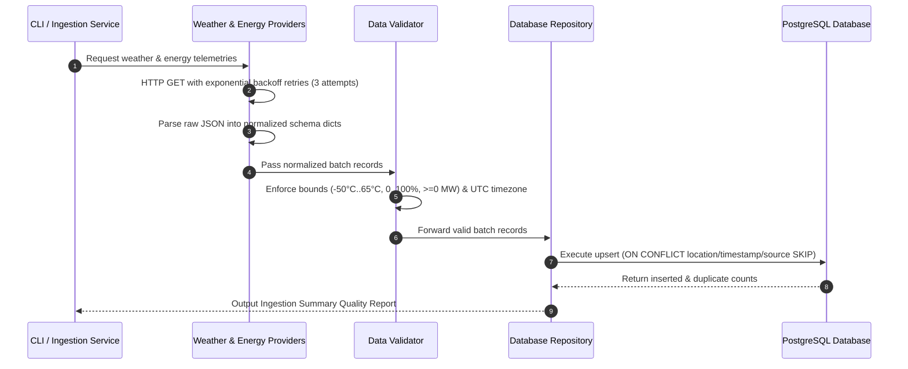
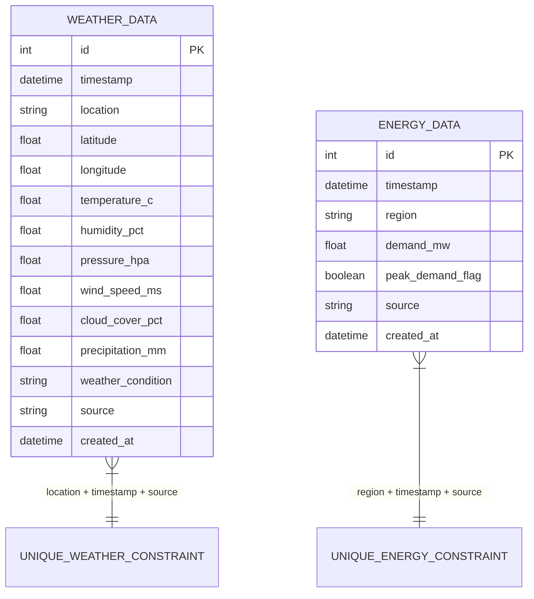

# System Architecture & Technical Specifications

## 1. Directory Structure & Responsibilities

```
energy-intelligence-platform/
│
├── app/
│   ├── backend/          # FastAPI server, endpoints, routers, CORS middleware, DTO schemas
│   ├── frontend/         # Streamlit control center dashboard, 10 modular views, custom CSS theme
│   ├── data/             # Ingestion orchestrator, providers (Open-Meteo, Open-Energy), validator, cleaner
│   │   └── providers/    # Data source abstractions (WeatherProvider, EnergyProvider, OpenMeteo, OpenEnergy)
│   ├── models/           # Abstract ML contracts & stubs (Rain Predictor, Forecaster, Anomaly Detector)
│   ├── services/         # Business analytics logic (Weather-Energy impact correlation, What-if simulator)
│   ├── database/         # PostgreSQL connection manager, SQLAlchemy ORM models, repository & session hooks
│   ├── utils/            # Standardized logger, helpers, formatting utilities
│   └── config/           # Centralized Pydantic BaseSettings loading from environment variables
│
├── tests/                # Pytest test suite for skeleton health, ingestion providers, validator & models
├── notebooks/            # Jupyter notebook workspace reserved for exploratory data analysis (EDA)
├── scripts/              # Data ingestion CLI runner (ingest_data.py) & migration scripts
├── docs/                 # Architecture documentation, diagrams, and design specifications
├── .env.example          # Environment variables template with placeholder keys
├── .gitignore            # Git exclusion definitions for secrets, virtual environments, and caches
├── requirements.txt      # Production-pinned Python package dependencies
├── README.md              # Complete project documentation and roadmap
└── run.py                # Unified CLI entrypoint to launch backend, frontend, ingest, or run tests
```

---

## 2. Data Sources & Provider Abstractions (Stage 2)

```mermaid
graph TD
    subgraph Data Sources
        OM[Open-Meteo Weather REST API]
        PJM[PJM / EIA Open Energy Demand Dataset]
    end

    subgraph Data Provider Abstraction Layer [app/data/providers/]
        WP[WeatherProvider ABC]
        EP[EnergyProvider ABC]
        OMP[OpenMeteoWeatherProvider]
        OEP[OpenEnergyProvider]
    end

    subgraph Validation & Cleaning [app/data/]
        VAL[DataValidator - Physical Bounds & UTC Checks]
        CLN[DataCleaner - Interpolation & Time Encodings]
    end

    subgraph Database Repository Layer [app/database/]
        WRepo[WeatherRepository - Upsert & ON CONFLICT]
        ERepo[EnergyRepository - Upsert & ON CONFLICT]
        DB[(PostgreSQL / SQLAlchemy ORM)]
    end

    OM --> OMP
    PJM --> OEP
    WP <|-- OMP
    EP <|-- OEP
    OMP --> VAL
    OEP --> VAL
    VAL --> CLN
    CLN --> WRepo
    CLN --> ERepo
    WRepo --> DB
    ERepo --> DB
```

### Data Sources Summary
- **Weather Data Source**: Open-Meteo API (`https://api.open-meteo.com/v1/forecast`). Free, open, high-accuracy public meteorological API requiring no API key for basic development.
  - Fields: `timestamp` (UTC ISO), `location`, `latitude`, `longitude`, `temperature_c`, `humidity_pct`, `pressure_hpa`, `wind_speed_ms`, `cloud_cover_pct`, `precipitation_mm`, `weather_condition`, `source="Open-Meteo-API"`.
- **Energy Data Source**: PJM / EIA Open Energy Demand Dataset (`source="PJM_OpenData_Historical"`).
  - Fields: `timestamp` (UTC ISO), `region`, `demand_mw`, `peak_demand_flag`, `source="PJM_OpenData_Historical"`.

---

## 3. Data Pipeline & Ingestion Sequence Flow



---

## 4. Database Entity Relationship (ER) Schema & Duplicate Prevention



---

## 5. Timezone Strategy & UTC Standard

- **Internal Storage**: All timestamps are parsed, converted, and stored as timezone-aware UTC objects (`datetime.now(timezone.utc)` / ISO-8601 UTC).
- **Database Column Type**: SQLAlchemy `DateTime(timezone=True)`.
- **Display Layer**: Presentation modules convert UTC timestamps to local browser timezone at render time.

---

## 6. Retry & Network Resilience Policy

- **HTTP Client**: `httpx` client configured with a 10-second request timeout.
- **Exponential Backoff**: Up to 3 retry attempts with delays of 1s, 2s, 4s for network timeouts or HTTP 5xx errors.
- **Error Shielding**: Failed API calls output structured error logs without terminating the rest of the ingestion workflow.
